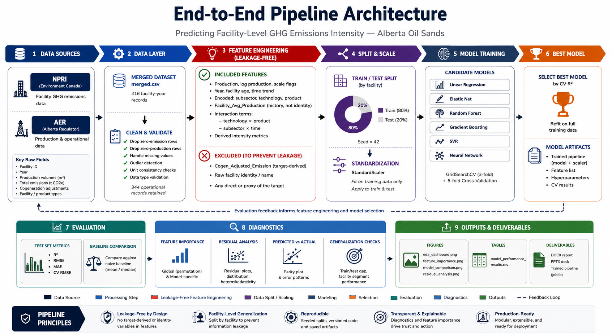

# Predicting GHG Emissions Intensity in Alberta's Oil Sands

Machine learning pipeline to predict facility-level greenhouse gas (GHG)
emissions intensity in Alberta's oil sands sector, using operational and
technological features from Canada's National Pollutant Release Inventory
(NPRI) and Alberta Energy Regulator (AER) data.

**DATA 606 Capstone Project** · Paul Moynihan, Ifeanyi Njoku, Anmol Sharma

---

## Project Summary

- **Goal:** predict facility-level `Emission_Intensity` (tonnes CO2e per m³
  of production) and identify its operational drivers.
- **Data:** 344 facility-year observations, 2011–2023, after removing
  non-operational records.
- **Approach:** six regression models (Linear Regression, Elastic Net,
  Random Forest, Gradient Boosting, SVR, Neural Network), compared with
  5-fold cross-validation and hyperparameter tuning via `GridSearchCV`.
- **Best model:** Random Forest — **Test R² ≈ 0.50**, Test RMSE ≈ 0.74
  tCO2e/m³, using only production, technology, and temporal features.

> **Note on methodology:** an early version of this project accidentally
> included a feature mathematically identical to the target
> (`Emission / Production`), producing a spurious R² of ~1.00. That issue
> was identified and fixed — see [`docs/METHODOLOGY.md`](docs/METHODOLOGY.md)
> for the full explanation. The pipeline in this repo is leakage-free.

---

## Pipeline Architecture



> **Note:** this diagram documents the full intended architecture,
> including a few elements not yet implemented in `main.py` — notably a
> **facility-grouped** train/test split (the current split is a random
> row-level split, not grouped by facility), a **naive-baseline
> comparison**, and a **saved model artifact** (`joblib`) for reuse
> without retraining. Everything else — the leakage-free feature
> engineering, the six candidate models, GridSearchCV + 5-fold CV, and
> the evaluation/diagnostics/outputs stages — matches the code as
> written. Treat the gaps above as the next items on the roadmap (see
> [Limitations & Future Work](#limitations--future-work)).

---

## Key Findings

| Driver | Approx. importance | Interpretation |
|---|---|---|
| Production volume (log + raw) | ~61% | Larger facilities are more efficient — economies of scale |
| Facility production history | ~18% | Operational maturity/experience matters |
| Extraction technology | ~4% | SAGD, CSS, NFT, PFT differ in efficiency |
| Technology × product interaction | ~3% | Technology-product fit matters |
| Time trend | statistically significant | Industry-wide intensity is decreasing (~-0.018 tCO2e/m³/yr, p=0.031) |

**Policy implication:** regulation focused on operational efficiency and
scale is likely to have more leverage than technology-specific mandates.

---

## Repository Structure

```
.
├── data/
│   └── oil_sands_emissions_merged.csv   # merged NPRI + AER facility data
├── src/
│   ├── data_processing.py               # load, clean, feature engineering
│   ├── eda.py                           # summary stats + EDA plots
│   └── modeling.py                      # model configs, training, plots
├── results/
│   ├── figures/                         # generated plots (png)
│   └── tables/                          # generated results (csv)
├── reports/
│   ├── DATA_606_Project_Report.docx     # full written report
│   └── Project_Presentation.pptx        # slide deck
├── docs/
│   ├── METHODOLOGY.md                   # data leakage note & feature rationale
│   └── pipeline_architecture.png        # end-to-end architecture diagram
├── main.py                              # pipeline entry point
├── requirements.txt
├── LICENSE
└── README.md
```

---

## Getting Started

### 1. Clone and install dependencies

```bash
git clone https://github.com/<your-username>/oil-sands-emissions-intensity.git
cd oil-sands-emissions-intensity
python -m venv venv && source venv/bin/activate   # optional but recommended
pip install -r requirements.txt
```

### 2. Run the pipeline

```bash
python main.py
```

Optional arguments:

```bash
python main.py --data data/oil_sands_emissions_merged.csv \
                --output results/ \
                --test-size 0.2 \
                --random-state 42
```

This will:
1. Load and clean the data
2. Engineer leakage-free features
3. Run EDA and save figures to `results/figures/`
4. Train and evaluate six models
5. Save a performance comparison table to `results/tables/`
6. Save feature importance, model comparison, and residual diagnostic plots

Runtime: ~1–2 minutes on a standard CPU (no GPU required).

---

## Results

### Model comparison (test set)

| Model | Test R² | Test RMSE | Test MAE | CV RMSE |
|---|---|---|---|---|
| **Random Forest** | **0.496** | **0.741** | 0.187 | 0.309 |
| Linear Regression | 0.491 | 0.744 | 0.297 | 0.332 |
| Support Vector Regression | 0.464 | 0.764 | 0.246 | 0.344 |
| Gradient Boosting | 0.450 | 0.774 | 0.187 | 0.299 |
| Elastic Net | 0.438 | 0.782 | 0.285 | 0.330 |
| Neural Network | 0.375 | 0.825 | 0.350 | 0.344 |

Full table: [`results/tables/model_performance_results.csv`](results/tables/model_performance_results.csv)

### Figures

- `results/figures/eda_dashboard.png` — 12-panel exploratory analysis
- `results/figures/correlation_heatmap.png` — feature correlations
- `results/figures/model_comparison.png` — metrics + predicted-vs-actual for all 6 models
- `results/figures/feature_importance.png` — Random Forest & Gradient Boosting importances
- `results/figures/residual_analysis.png` — diagnostics for the best model

---

## Reports & Presentation

- [`reports/DATA_606_Project_Report.docx`](reports/DATA_606_Project_Report.docx) — full written report (introduction, data, methodology, EDA, model results, conclusion)
- [`reports/Project_Presentation.pptx`](reports/Project_Presentation.pptx) — 17-slide deck covering the same material, including a dedicated slide on the leakage correction described in `docs/METHODOLOGY.md`

Both documents report the same reconciled numbers as this README and `results/tables/model_performance_results.csv` (Random Forest, Test R² = 0.4955).

---

## Data Sources

- [Canada's National Pollutant Release Inventory (NPRI)](https://www.canada.ca/en/environment-climate-change/services/national-pollutant-release-inventory.html)
- [Alberta Energy Regulator (AER)](https://www.aer.ca/) operational and production data

The merged dataset (`data/oil_sands_emissions_merged.csv`) combines
facility-level emissions and production records for Alberta oil sands
operations, 2011–2023.

---

## Limitations & Future Work

- ~50% of variance remains unexplained by production, technology, and
  temporal features alone. Likely contributors not in this dataset:
  equipment age, maintenance schedules, energy source mix, carbon capture
  deployment, and weather/geological conditions.
- Models currently treat each facility-year as independent; a panel-data
  approach (fixed/random effects, lagged terms) could better exploit the
  time-series structure.
- **Roadmap items shown in the architecture diagram but not yet built:**
  - Switch to a facility-grouped train/test split (e.g. `GroupShuffleSplit`
    on `Facility`) so no facility appears in both train and test —
    a stronger generalization check than the current random row split.
  - Add a naive-baseline comparison (predict the mean/median intensity)
    so R²/RMSE improvements are reported relative to that baseline.
  - Persist the winning model + scaler + feature list as a `joblib`
    artifact under `results/` for reuse without retraining.
- See [`docs/METHODOLOGY.md`](docs/METHODOLOGY.md) for the full discussion.

---

## License

This project is licensed under the MIT License — see [LICENSE](LICENSE).

## Authors

Paul Moynihan · Ifeanyi Njoku · Anmol Sharma
DATA 606 Capstone Project
